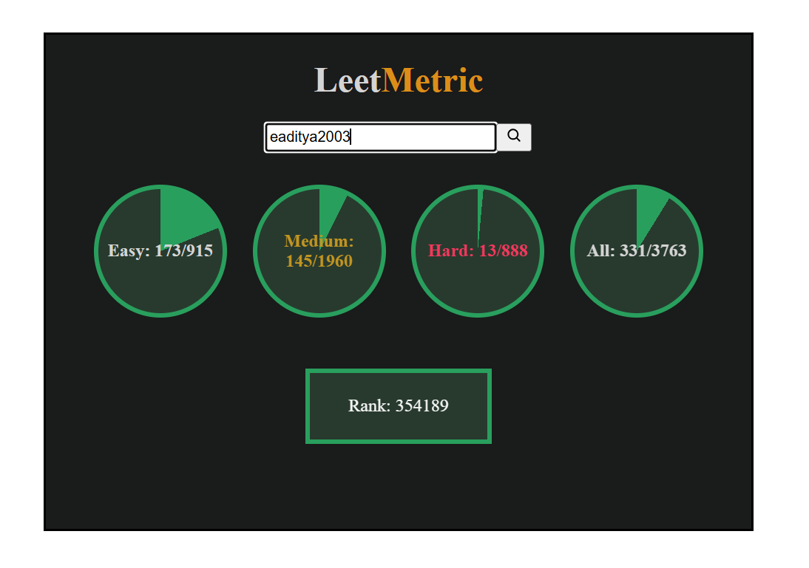

# LeetMetric — LeetCode Progress Tracker

LeetMetric is a small full-stack web application that visualizes LeetCode user progress (Easy / Medium / Hard / All) along with global rank using LeetCode’s GraphQL API.  
It displays progress using interactive charts on the frontend and retrieves real-time data through a Node.js + Express backend.

---

## 📸 Screenshot

---

## 📌 Features
- Search any LeetCode username  
- Donut/progress charts for:
  - Easy solved  
  - Medium solved  
  - Hard solved  
  - Overall solved  
- Displays global rank  
- Clean UI (HTML/CSS/JS)  
- Backend powered by Node.js + Express  
- Secure frontend-backend communication with proper CORS setup  

---

## 🛠️ Tech Stack
- **Frontend:** HTML, CSS, JavaScript  
- **Backend:** Node.js, Express  
- **API:** LeetCode GraphQL  

---
